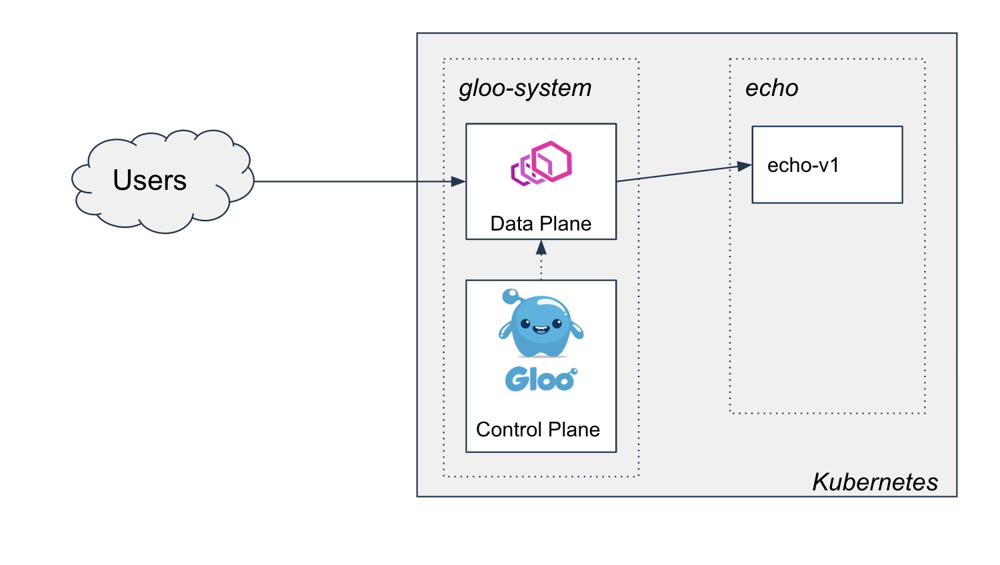
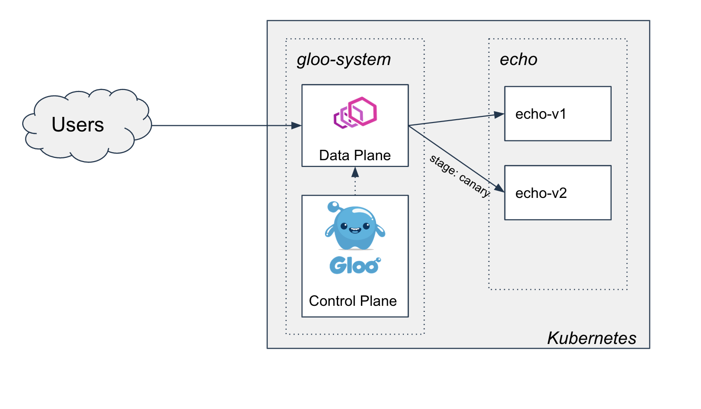
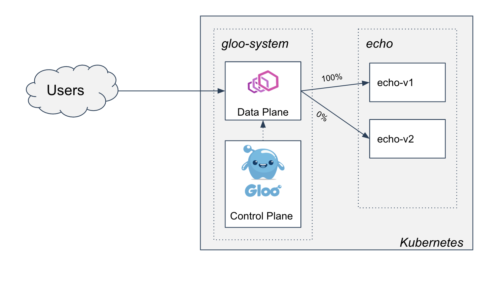
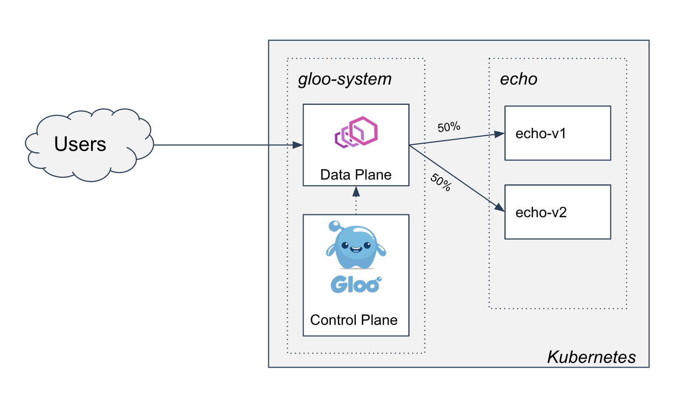
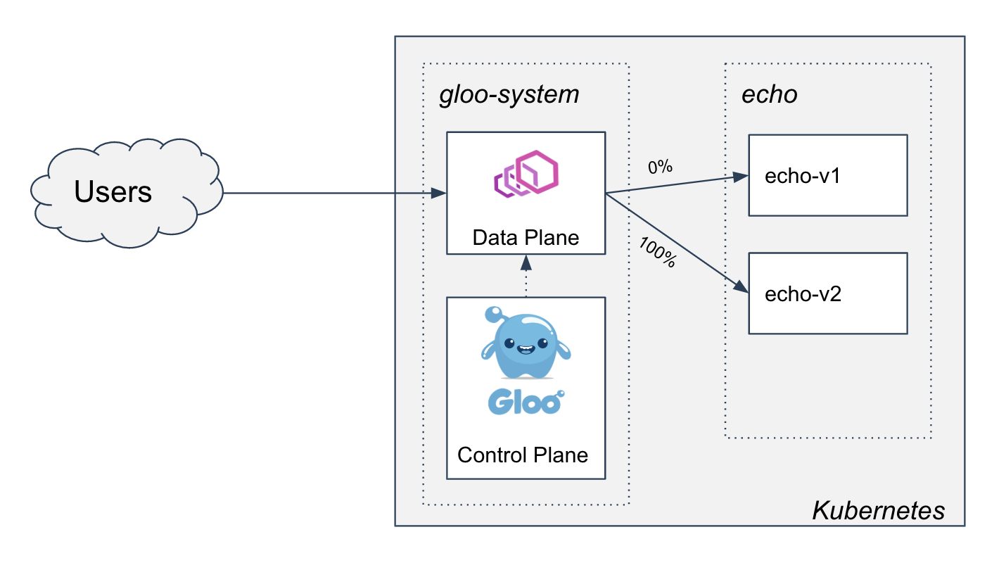

# Two-phased canary rollout with Open Source Gloo

As engineering organizations move towards microservices, containers, and Kubernetes, they are leveraging API gateways and
service mesh technology to help with those migrations, and to unlock new capabilities for managing, observing, and securing 
traffic to their application. 

A common operational question to consider when building out your application platform is: how to migrate user traffic to a new
version of a service? This is sometimes referred to as a canary rollout or progressive delivery. In this post, we'll look at 
how Gloo can be used as an API gateway to facilitate canary rollouts of new user-facing services in Kubernetes, while supporting
correctness and performance-based acceptance tests on the new version. 

## Initial setup

To start, we need a Kubernetes cluster. This example doesn't take advantage of any cloud specific 
features, and can be run against a local test cluster such as [minikube](https://kubernetes.io/docs/tasks/tools/install-minikube/). 
This post assumes a basic understanding of Kubernetes and how to interact with it using `kubectl`. 

To start, we'll install the latest [open source Gloo](https://github.com/solo-io/gloo) to the `gloo-system` namespace and deploy 
 version `v1` of an example application to the `echo` namespace. We'll expose this application outside the cluster 
 by creating a route in Gloo, to end up with a picture like this: 



### Deploying Gloo

To start, we'll deploy open source Gloo. We can get the latest `glooctl` command line tool downloaded and added to the path
by running:

```bash
curl -sL https://run.solo.io/gloo/install | sh
export PATH=$HOME/.gloo/bin:$PATH
```

Now, you should be able to run `glooctl version` to see that it is installed correctly:

```bash
➜ glooctl version
Client: {"version":"1.3.15"}
Server: version undefined, could not find any version of gloo running
```

Now we can install the gateway to our cluster with a simple command:

```bash
glooctl install gateway
```

The console should indicate the install finishes successfully:

```bash
Creating namespace gloo-system... Done.
Starting Gloo installation...

Gloo was successfully installed!

```

### Deploying the application

Our `echo` application is a simple container (thanks to our friends at HashiCorp) that will 
respond with the application version, to help demonstrate our canary workflows as we start testing and 
shifting traffic to a `v2` version of the application. 

Kubernetes gives us a lot of flexibility in terms of modeling this application. We'll adopt the following 
conventions:
* We'll include the version in the deployment name so we can run two versions of the application 
side-by-side and manage their lifecycle differently. 
* We'll label pods with an app label (`app: echo`) and a version label (`version: v1`) to help with our canary rollout. 
* We'll deploy a single Kubernetes `Service` for the application to set up networking. Instead of updating 
this or using multiple services to manage routing to different versions, we'll manage the rollout with Gloo configuration. 

The following is our `v1` echo application: 

```yaml
apiVersion: apps/v1
kind: Deployment
metadata:
  name: echo-v1
spec:
  replicas: 1
  selector:
    matchLabels:
      app: echo
      version: v1
  template:
    metadata:
      labels:
        app: echo
        version: v1
    spec:
      containers:
        # Shout out to our friends at Hashi for this useful test server
        - image: hashicorp/http-echo
          args:
            - "-text=version:v1"
            - -listen=:8080
          imagePullPolicy: Always
          name: echo-v1
          ports:
            - containerPort: 8080
```

And here is the `echo` Kubernetes `Service` object:

```yaml
apiVersion: v1
kind: Service
metadata:
  name: echo
spec:
  ports:
    - port: 80
      targetPort: 8080
      protocol: TCP
  selector:
    app: echo
```

For convenience, we've published this yaml in a repo so we can deploy it with the following command:

```bash
kubectl apply -f https://raw.githubusercontent.com/solo-io/gloo-ref-arch/6175c8f05ceabec3e5028616767c412d49d857d9/platform/prog-delivery/two-phased-with-os-gloo/1-setup/echo.yaml
```

We should see the following output:
```bash
namespace/echo created
deployment.apps/echo-v1 created
service/echo created
```

And we should be able to see all the resources healthy in the `echo` namespace:
```bash
➜ k get all -n echo
NAME                           READY   STATUS    RESTARTS   AGE
pod/echo-v1-66dbfffb79-287s5   1/1     Running   0          6s

NAME           TYPE        CLUSTER-IP      EXTERNAL-IP   PORT(S)   AGE
service/echo   ClusterIP   10.55.252.216   <none>        80/TCP    6s

NAME                      READY   UP-TO-DATE   AVAILABLE   AGE
deployment.apps/echo-v1   1/1     1            1           7s

NAME                                 DESIRED   CURRENT   READY   AGE
replicaset.apps/echo-v1-66dbfffb79   1         1         1       7s
```

### Exposing outside the cluster with Gloo

We can now expose this service outside the cluster with Gloo. First, we'll model the application as a Gloo `Upstream`, which is Gloo's abstraction 
for a traffic destination. In this case the `Upstream` object just includes basic information about the Kubernetes service; later, we'll 
add more configuration to support a canary rollout:

```yaml
apiVersion: gloo.solo.io/v1
kind: Upstream
metadata:
  name: echo
  namespace: gloo-system
spec:
  kube:
    selector:
      app: echo
    serviceName: echo
    serviceNamespace: echo
    servicePort: 8080
```

We can now create a route to this upstream in Gloo by defining a **virtual service**:

```yaml
apiVersion: gateway.solo.io/v1
kind: VirtualService
metadata:
  name: echo
  namespace: gloo-system
spec:
  virtualHost:
    domains:
      - '*'
    routes:
      - matchers:
          - prefix: /
        routeAction:
          single:
            upstream:
              name: echo
              namespace: gloo-system
```

We can apply these resources with the following commands:

```bash
kubectl apply -f https://raw.githubusercontent.com/solo-io/gloo-ref-arch/6175c8f05ceabec3e5028616767c412d49d857d9/platform/prog-delivery/two-phased-with-os-gloo/1-setup/upstream.yaml
kubectl apply -f https://raw.githubusercontent.com/solo-io/gloo-ref-arch/6175c8f05ceabec3e5028616767c412d49d857d9/platform/prog-delivery/two-phased-with-os-gloo/1-setup/vs.yaml
```

Once we apply these two resources, we can start to send traffic to the application through Gloo:

```bash
➜ curl $(glooctl proxy url)/
version:v1
```

## Two-Phased Rollout Strategy

Now we have a new version `v2` of the echo application that we wish to roll out. We know that when the  
rollout is complete, we are going to end up with this picture:


However, to get there, we may want to perform a few rounds of testing to ensure the new version of the application
meets certain correctness and/or performance acceptance criteria. In this post, we'll introduce a two-phased approach to 
canary rollout with Gloo, that could be used to satisfy the vast majority of acceptance tests. 

In the first phase, we'll perform smoke and correctness tests by routing a small segment of the traffic to the new version 
of the application. In this demo, we'll use a header `stage: canary` to trigger routing to the new service, though in 
practice it may be desirable to make this decision based on another part of the request, such as the claim in a verified JWT. 

In the second phase, we've already established correctness, so we are ready to shift all of the traffic over to the new 
version of the application. We'll configure weighted destinations, and shift the traffic while monitoring certain business 
metrics to ensure the service quality remains at acceptable levels. Once 100% of the traffic is shifted to the new version, 
the old version can be decommissioned. 

In practice, it may be desirable to only use one of the phases for testing, in which case the other phase can be 
skipped. 

## Phase 1: Initial canary rollout of v2

In this phase, we'll deploy `v2`, and then use a header `stage: canary` to start routing a small amount of specific 
traffic to the new version. We'll use this header to perform some basic smoke testing and make sure `v2` is working the 
way we'd expect:



### Setting up subset routing

To do this, we're going to take advantage of a Gloo feature called [subset routing](LINK). We'll use the version label 
to define subsets of the `echo` application called `v1` and `v2`. Then we'll update our routes to specify the subset on 
the route destination, when the desired matching criteria are met. 

First, we need to update the upstream to include a subset definition:

```yaml
apiVersion: gloo.solo.io/v1
kind: Upstream
metadata:
  name: echo
  namespace: gloo-system
spec:
  kube:
    selector:
      app: echo
    serviceName: echo
    serviceNamespace: echo
    servicePort: 8080
    subsetSpec:
      selectors:
        - keys:
            - version
```

Then, we'll update our route to this upstream to specify the `v1` subset, like so:

```yaml
apiVersion: gateway.solo.io/v1
kind: VirtualService
metadata:
  name: echo
  namespace: gloo-system
spec:
  virtualHost:
    domains:
      - '*'
    routes:
      - matchers:
          - prefix: /
        routeAction:
          single:
            upstream:
              name: echo
              namespace: gloo-system
            subset:
              values:
                version: v1
```

We can apply them to the cluster with the following commands:

```bash
kubectl apply -f https://raw.githubusercontent.com/solo-io/gloo-ref-arch/6175c8f05ceabec3e5028616767c412d49d857d9/platform/prog-delivery/two-phased-with-os-gloo/2-initial-subset-routing-to-v2/upstream.yaml
kubectl apply -f https://raw.githubusercontent.com/solo-io/gloo-ref-arch/6175c8f05ceabec3e5028616767c412d49d857d9/platform/prog-delivery/two-phased-with-os-gloo/2-initial-subset-routing-to-v2/vs-1.yaml
```

The application should continue to function as before:

```bash
➜ curl $(glooctl proxy url)/
version:v1
```

### Deploying echo v2

Now we can safely deploy `v2` of the echo application:

```yaml
apiVersion: apps/v1
kind: Deployment
metadata:
  name: echo-v2
spec:
  replicas: 1
  selector:
    matchLabels:
      app: echo
      version: v2
  template:
    metadata:
      labels:
        app: echo
        version: v2
    spec:
      containers:
        - image: hashicorp/http-echo
          args:
            - "-text=version:v2"
            - -listen=:8080
          imagePullPolicy: Always
          name: echo-v2
          ports:
            - containerPort: 8080
```

We can deploy with the following command:

```bash
kubectl apply -f https://raw.githubusercontent.com/solo-io/gloo-ref-arch/6175c8f05ceabec3e5028616767c412d49d857d9/platform/prog-delivery/two-phased-with-os-gloo/2-initial-subset-routing-to-v2/echo-v2.yaml
```

Since our gateway is configured to route specifically to the `v1` subset, this should have no effect. However, it does enable 
`v2` to be routable from the gateway if the `v2` subset is configured for a route. 

### Adding a route to v2 for canary testing

We'll route to the `v2` subset when the `stage: canary` header is supplied on the request. If the header isn't 
provided, we'll continue to route to the `v1` subset as before.  

```yaml
apiVersion: gateway.solo.io/v1
kind: VirtualService
metadata:
  name: echo
  namespace: gloo-system
spec:
  virtualHost:
    domains:
      - '*'
    routes:
      - matchers:
          - headers:
              - name: stage
                value: canary
            prefix: /
        routeAction:
          single:
            upstream:
              name: echo
              namespace: gloo-system
            subset:
              values:
                version: v2
      - matchers:
          - prefix: /
        routeAction:
          single:
            upstream:
              name: echo
              namespace: gloo-system
            subset:
              values:
                version: v1
```

We can deploy with the following command:

```bash
kubectl apply -f https://raw.githubusercontent.com/solo-io/gloo-ref-arch/6175c8f05ceabec3e5028616767c412d49d857d9/platform/prog-delivery/two-phased-with-os-gloo/2-initial-subset-routing-to-v2/vs-2.yaml
```

### Canary testing

Now that we have this route, we can do some testing. First let's ensure that the existing route is working as expected:

```bash
➜ curl $(glooctl proxy url)/
version:v1
```

And now we can start to canary test our new application version:

```bash
➜ curl $(glooctl proxy url)/ -H "stage: canary"
version:v2
```

### Advanced use cases for subset routing

We may decide that this approach, using user-provided request headers, is too open. Instead, we may 
want to restrict canary testing to a known, authorized user. 

A common implementation of this that we've seen is for the canary route to require a valid JWT that contains
a specific claim to indicate the subject is authorized for canary testing. Enterprise Gloo has out of the box 
support for verifying JWTs, updating the request headers based on the JWT claims, and recomputing the 
routing destination based on the updated headers. We'll save that for a future post covering more advanced use 
cases in canary testing. 

## Phase 2: Shifting all traffic to v2 and decommissioning v1

At this point, we've deployed `v2`, and created a route for canary testing. If we are satisfied with the 
results of the testing, we can move on to phase 2 and start shifting the load from `v1` to `v2`. We'll use 
**weighted destinations** in Gloo to manage the load during the migration. 

### Setting up the weighted destinations

In order to enable weighted destinations, we need to model each version as a separate upstream destination. First, we'll update 
the existing upstream to add a version to the selector. 

```yaml
apiVersion: gloo.solo.io/v1
kind: Upstream
metadata:
  name: echo
  namespace: gloo-system
spec:
  kube:
    selector:
      app: echo
      version: v1
    serviceName: echo
    serviceNamespace: echo
    servicePort: 8080
```

Next, we'll add a new upstream to represent the canary destination:

```yaml
apiVersion: gloo.solo.io/v1
kind: Upstream
metadata:
  name: echo-canary
  namespace: gloo-system
spec:
  kube:
    selector:
      app: echo
      version: v2
    serviceName: echo
    serviceNamespace: echo
    servicePort: 8080
```

Now we can change the Gloo route to route to both of these destinations, starting with sending all the traffic to the v1. 

```yaml
apiVersion: gateway.solo.io/v1
kind: VirtualService
metadata:
  name: echo
  namespace: gloo-system
spec:
  virtualHost:
    domains:
      - '*'
    routes:
      - matchers:
          - prefix: /
        routeAction:
          multi:
            destinations:
              - weight: 10
                destination:
                  upstream:
                    name: echo
                    namespace: gloo-system
              - weight: 0
                destination:
                  upstream:
                    name: echo-canary
                    namespace: gloo-system
```

We can apply these resources to the cluster with the following commands:
```bash
kubectl apply -f https://raw.githubusercontent.com/solo-io/gloo-ref-arch/6175c8f05ceabec3e5028616767c412d49d857d9/platform/prog-delivery/two-phased-with-os-gloo/3-progressive-traffic-shift-to-v2/upstream.yaml
kubectl apply -f https://raw.githubusercontent.com/solo-io/gloo-ref-arch/6175c8f05ceabec3e5028616767c412d49d857d9/platform/prog-delivery/two-phased-with-os-gloo/3-progressive-traffic-shift-to-v2/upstream-canary.yaml
kubectl apply -f https://raw.githubusercontent.com/solo-io/gloo-ref-arch/6175c8f05ceabec3e5028616767c412d49d857d9/platform/prog-delivery/two-phased-with-os-gloo/3-progressive-traffic-shift-to-v2/vs-2.yaml
```

Now the cluster looks like this:



With the initial weights, we should see the gateway continue to serve `v1` for all traffic.

```bash
➜ curl $(glooctl proxy url)/
version:v1
```

### Commence rollout

To simulate a load test, let's shift half the traffic to `v2`:



This can be expressed on our virtual service by adjusting the weights:

```yaml
apiVersion: gateway.solo.io/v1
kind: VirtualService
metadata:
  name: echo
  namespace: gloo-system
spec:
  virtualHost:
    domains:
      - '*'
    routes:
      - matchers:
          - prefix: /
        routeAction:
          multi:
            destinations:
              - weight: 5
                destination:
                  upstream:
                    name: echo
                    namespace: gloo-system
              - weight: 5
                destination:
                  upstream:
                    name: echo-canary
                    namespace: gloo-system
```

We can apply this to the cluster with the following command:

```bash
kubectl apply -f https://raw.githubusercontent.com/solo-io/gloo-ref-arch/54231a9e1fe2150319e05e2ccbd2ccaa50927789/platform/prog-delivery/two-phased-with-os-gloo/3-progressive-traffic-shift-to-v2/vs-3.yaml
```

Now when we send traffic to the gateway, we should see half of the requests return `version:v1` and the 
other half return `version:v2`. 

```bash
➜ curl $(glooctl proxy url)/
version:v1
➜ curl $(glooctl proxy url)/
version:v2
➜ curl $(glooctl proxy url)/
version:v1
```

In practice, during this process it's likely you'll be monitoring some performance and business metrics 
to ensure the traffic shift isn't resulting in a decline in the overall quality of service. We can even 
leverage operators like [Flagger](https://github.com/weaveworks/flagger) to help automate this Gloo 
workflow. Gloo Enterprise integrates with your metrics backend and provides out of the box and dynamic, 
upstream-based dashboards that can be used to monitor the health of the rollout. 
We will save these topics for a future post on advanced canary testing use cases with Gloo. 

### Finishing the rollout

We will continue adjusting weights until eventually, all of the traffic is now being routed to `v2`:



Our virtual service will look like this:

```yaml
apiVersion: gateway.solo.io/v1
kind: VirtualService
metadata:
  name: echo
  namespace: gloo-system
spec:
  virtualHost:
    domains:
      - '*'
    routes:
      - matchers:
          - prefix: /
        routeAction:
          multi:
            destinations:
              - weight: 0
                destination:
                  upstream:
                    name: echo
                    namespace: gloo-system
              - weight: 10
                destination:
                  upstream:
                    name: echo-canary
                    namespace: gloo-system
```

We can apply that to the cluster with the following command: 
```bash
kubectl apply -f https://raw.githubusercontent.com/solo-io/gloo-ref-arch/54231a9e1fe2150319e05e2ccbd2ccaa50927789/platform/prog-delivery/two-phased-with-os-gloo/3-progressive-traffic-shift-to-v2/vs-4.yaml
```

Now when we send traffic to the gateway, we should see all of the requests return `version:v2`. 

```bash
➜ curl $(glooctl proxy url)/
version:v2
➜ curl $(glooctl proxy url)/
version:v2
➜ curl $(glooctl proxy url)/
version:v2
```

### Decommissioning the old upstream
   
At this point, we have deployed the new version of our application, conducted correctness tests using subset routing, 
conducted load and performance tests by progressively shifting traffic to the new version, and finished 
the rollout. The only remaining task is to clean up our `v1` resources. 

First, we'll delete the `v1` deployment, which is no longer serving any traffic. 
            
```bash
kubectl delete deploy -n echo echo-v1
```

Second, we'll return the `echo` upstream to the original state we started. Since there is only one version
of the application of the deployment on the cluster, we don't need the `version` in the selector anymore. 
We can re-introduce a version in the selctor, or a subset spec, when it's time to roll out a new version `v3`. 

```yaml
apiVersion: gloo.solo.io/v1
kind: Upstream
metadata:
  name: echo
  namespace: gloo-system
spec:
  kube:
    selector:
      app: echo
    serviceName: echo
    serviceNamespace: echo
    servicePort: 8080
```

We can apply this to the cluster with the following command: 

```bash
kubectl apply -f https://raw.githubusercontent.com/solo-io/gloo-ref-arch/d61dbf5cf62d605149e82e32192ce17788f109ec/platform/prog-delivery/two-phased-with-os-gloo/4-decommissioning-v1/upstream.yaml
```

Third, we can update our virtual service to only route to the `echo` upstream, as we had in the beginning:

```yaml
apiVersion: gateway.solo.io/v1
kind: VirtualService
metadata:
  name: echo
  namespace: gloo-system
spec:
  virtualHost:
    domains:
      - '*'
    routes:
      - matchers:
          - prefix: /
        routeAction:
          single:
            upstream:
              name: echo
              namespace: gloo-system
```

```bash
kubectl apply -f https://raw.githubusercontent.com/solo-io/gloo-ref-arch/d61dbf5cf62d605149e82e32192ce17788f109ec/platform/prog-delivery/two-phased-with-os-gloo/4-decommissioning-v1/vs.yaml
```

Finally, we'll delete the `echo-canary` upstream. We can add a new canary upstream in the future when we need it. 

```bash
kubectl delete upstream -n gloo-system echo-canary
``` 

Now our cluster looks like this:


And requests to the gateway return this:

```bash
➜ curl $(glooctl proxy url)/
version:v2
```

We have now completed our two-phased canary rollout of an application update using Gloo!

## Other Advanced Topics

Over the course of this post, we collected a few topics that could be a good starting point for advanced exploration:

* Using the **JWT** filter to verify JWTs, extract claims onto headers, and route to canary versions depending on a claim value. 
* Looking at **Prometheus metrics** and **Grafana dashboards** created by Gloo to monitor the health of the rollout. 
* Automating the rollout by integrating **Flagger** with **Gloo**

A few other topics that warrant further exploration:

* Supporting **self-service** upgrades by giving teams ownership over their upstream and route configuration
* Utilizing Gloo's **delegation** feature and Kubernetes **RBAC** to decentralize the configuration management safely
* Fully automating the continuous delivery process by applying **GitOps** principles and using tools like **Flux** to push config to the cluster
* Supporting **hybrid** or **non-Kubernetes** application use-cases by setting up Gloo with a different deployment pattern
* Adding a phase of testing where **traffic shadowing** is used to send traffic to the new version 
